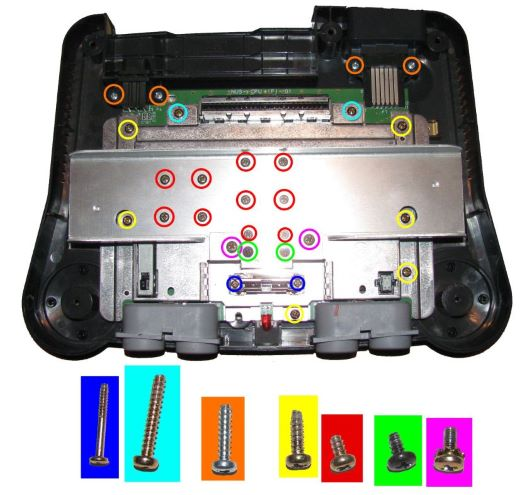
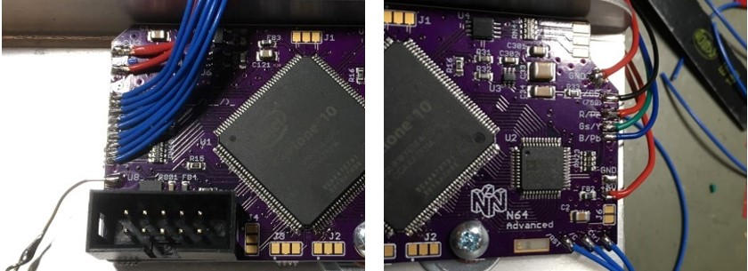

# N64 Advanced (PCB)

## Assembly

## Installation

### 1. Open the console

- Remove Jumper Pak / Expansion Pak
- Remove screws from bottom side of the console  
(needs a 4.5mm gamebit tool)
- Lift top housing
- remove inner screws as marked  
(in very last consoles made the heat sink design changed slightly)
- pull out the mainboard
- remove heat sink and RF shield
- **Hint** Now you have the chance to clean up your N64 shell

(image by Zerberus (circuit-board.de user))

### 2. Optional Steps

#### 2.1 Preparation of Top RF Shield

This step is optional.
It helps a) to reduce mechanical stress on the flex cable (if used) and b) ensures maximal distance between digital signals (installation wires or flex cable) and analog signals (MultiOut).

- Locate the tap in the RF shield next to the cartridge slot at the side of the MultiOut.  
(this is the place where the installation wires / flex cable will be routed through)
- option 1: bend the tap away

- option 2: simply cut the tab incl. the small piece up to the step in the RF shield

##### Some explanation on this optional step

Later, the data lines as well as the clock will be routed close to the MultiOut.
The distance between both is a crucial issue as your wires act as interferer.
Hence, having the tap bended might be ok, but it is better to cut some piece of the RF shield away to further increase the distance between MultiAV and data lines

#### GND insulation on the MultiOut

In order to have a better return path for the digital video lines defined, you may insulate GND from the MultiOut.
This step is only recommended if you have a noisy picture.
It comes with the drawback that a) you have a lot of more effort during installation and b) having a longer return path for the analog audio output as well as for S-Video and Composte Video as GND is later routed over the modding board.

- desolder the MultiOut connector
- drill out the GND pads
- insulare the drilles (e.g. with varnish (flex cable or wire install) or small shrink tubes (only wire installation))
- solder MoultiOut back into place

### 3. Solder Work

You have the options to either install everything with casual installation wires or using flex cables.
This is just a trade-off between personal installation effort and price.
Personally I recommend using the flex cable.

#### 3.1 Using the Flex Cable 

To use this option, you have to have the flex cables as shown at hand.
Note that the picture shows older prototype version.

##### 3.1.1 Using the Flex Cable 

Start with the digital side:
- Solder the RCP connector side to the RCP-NUS as shown
  - first pin bottom – 8
  - last pin to – 28
- Connect 3.3V to the flex, e.g. taken from C141
- Connect Ctrl. and reset
  - reset from PIF-NUS pin 27
  - Controller from PIF-NUS pin 16  
  (Make sure that PIF-NUS pin 16 is connected to the middle pin of controller port 1, otherwise search for a suiteable connection point)
- bend the flex as marked in a way such that you do not see the shaded area anymore.  
The flex will be routed over the MultiOut.

**Note**: when using the flex of version earlier than _v2022xxyy_ you need to cut the RF shield near the MultiOut as shown in 2.1

Next up is the analog video flex which will be connected to the MultiOut.
Before you start here, make yourself clear where you want to route sync to.
This depends on whether you want to use sync on luma or sync on composite sync (raw sync) cable.

- Free the sync pin from the MultiOut, which means that you have to trace back the copper track from the MultiOut pin and make sure that there is nothing connected to.
  - pin 3 (raw sync cable): usually unconnected. Only connected in earlier NTSC console (-CPU-01 to -CPU-03)
  - pin 7 (luma sync cable): usually connected. Search for a nearby resistor or trace back to the DENC-NUS or MAV-NUS and lift the luma pin. Remove the resistor or lift the pin at the DENC-NUS or MAV-NUS.
- solder the flex on its place of the MultiOut
- close **SJ1** from
  - middle to 3 if using raw sync
  - middle to 7 if using luma sync
- Note that it is also possible to connect sync pin 9 if you want to use a sync on composite video cable.
  - disconnect composite vide from pin 9 using the back tracing technique
  - solder a small wire from **SJ1** middle pad to pin 9 of the MultiOut

#### 3.2 Using Wires

First you need to work out the digital video signals as well as reset and controller 1. 
Most of the signals needed has to be taken from video processor output; the RCP-NUS.
Next to the RCP-NUS is the video encoder, where several types are used during the variety of N64 designs.
The pinouts are given below. Basically we need D0-D6, /DSYNC and /CLK (or VCLK or CLOCK) for the modding board.

(RCP-NUS picture by Marshall; Encoder picture by Viletim)

Next to the video signals, you will need to get power (3.3V and GND), reset and controller 1.
This means you need in total 13 wires.
If you use a ribbon cable, I recommend you to use either a 15 conductor cable (double 3.3V and GND) or a 11 conductor cable and separate 3.3V and GND wires. 

- Locate the video encoder
  - Solder a bunch of wires to the video signal pins D0-D6, /DSYNC and /CLK
- Solder wires for reset and controller 1
  - reset from PIF-NUS pin 27
  - Controller from PIF-NUS pin 16  
  (Make sure that PIF-NUS pin 16 is connected to the middle pin of controller port 1, otherwise search for a suiteable connection point)
- Solder two addional wires for 3.3V (can be picked off C141) and one for GND (large GND plane)
- Route all wires to the MultiOut port

Next you can prepare wires for the analog video.
Connect several wires to the MultiOut.
Before you start here, make yourself clear where you want to route sync to.
This depends on whether you want to use a sync on composte video, a sync on luma or a sync on composite sync (raw sync) cable.

- Free the sync pin from the MultiOut, which means that you have to trace back the copper track from the MultiOut pin and make sure that there is nothing connected to.
  - pin 3 (raw sync cable): usually unconnected. Only connected in earlier NTSC console (-CPU-01 to -CPU-03)
  - pin 7 (luma sync cable): usually connected. Search for a nearby resistor or trace back to the DENC-NUS or MAV-NUS and lift the luma pin. Remove the resistor or lift the pin at the DENC-NUS or MAV-NUS.
  - pin 9 (compostie video sync cable): usually connected. Search for a nearby resistor or trace back to the DENC-NUS or MAV-NUS and lift the luma pin. Remove the resistor or lift the pin at the DENC-NUS or MAV-NUS.
- Prepare some wires to the following pins
  - pin 1: red
  - pin 2: green
  - pin 4: blue
  - pin 3, 7 or 9: sync
  - pin 5 and/or 6: GND (connect pin 5 **and** pin 6 if you insulated GND from the MultiOut)
  - pin 10: 5V

You have the option to use the FilterAddOn board here.
Note that the filter is optionally included in on the flex cable setup.

If you use the filter board, you clearly have to solder the filter board first and connect the wire to the pads of the filter board as marked on the silk screen.

  
### 4. Mount the N64 Advanced Modding PCB

The PCB is designed to fit on the heat sink of the N64.
There is a large via on the PCB where a M3 screw passes through.

If you have a 3D printer at hand, [Consoles4You](https://twitter.com/Consoles4You/status/1402648032848531457) created a beautiful 3D bracket to make mounting extremely easy.
File can be downloaded [here](https://t.co/0TzSATg8nK).
Main advantage is that you do not need to make sure that the JTAG connector does not short out at the heat sink.
Most selled kits comes with uncutted pins here, so there is a high risk.
Another advantage is that you can you a mainboard screw to secure the modding board.

If you do not have a 3D printer you can also mount the PCB using a M3 screw of length 10mm or 12mm, a set of washer and a nut.

If you want to use the heat sink shield as an additional secure GND connection you can also apply some solder to the mounting via.

If everything is mounted and secured, the PCB should sit like that.

### 5. Finish the Work

Before continue you can assemble the RF shield and heat sink back to the N64 mainboard.
In that way everything is secured in place where it belongs to.
Of course, if you use an installation with wires, make sure that you know which wire is for what.
On my ealrier installs I used some wire marker.

#### 5.1 With Flex Cable

Bend the flex cables gently at the shaded areas.
In that way you should be able to alling both flex cables at the N64 Advanced modding board.
Solder the flex cables at their places.

Connect an extra GND wire as shown in 5.3.

#### 5.2 With Wires

Just connect every wire at its place.
The silk screen shows you where everything goes to.
Note that the picture shows an older version of the N64 Advanced.
Newer versions have reset and controller at the left hand side.

Connect an extra GND wire as shown in 5.3.

#### Extra GND Wire

Connect an extra GND wire to the heat sink screw.
This improves return path properies of the digital video lines.

## Jumper Setup

## Cable Setup

